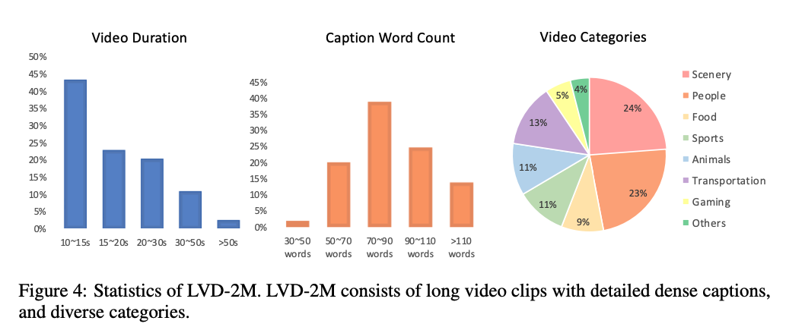

# LVD-2M: A Long-take Video Dataset with Temporally Dense Captions

Official Github repository of LVD-2M.

## Introduction
LVD-2M is a dataset featuring: 
1. long videos covering at least 10 seconds
2. long-take videos without cuts 
3. large motion and diverse contents 
4. temporally dense captions. 

## A Preview of LVD-2M

Video clips in LVD-2M are scene-cut-free and **at least 10s long**, accompanied by detailed and temporally dense captions. The displayed captions are from the `refined_caption` field.

*[Link](https://ic-cv-long-videos.s3.ap-northeast-2.amazonaws.com/LVD-2M/data/preview_videos.zip) for original preview videos without compression loss.*

<table class="center">
    <tr>
      <td width=33.3% style="border: none"></td>
      <td width=33.3% style="border: none"></td>
      <td width=33.3% style="border: none"></td>
    </tr>
    <tr style="text-align: center;">
      <td width=33.3% style="border: none">The video captures a cyclist performing a sequence of maneuvers at a skate park. The cyclist, wearing a helmet, is seen preparing to descend a ramp, executing the descent with speed and control, and landing safely at the bottom. The setting is consistent throughout, with the skate park visible in the background and the lighting suggesting a late afternoon or early evening timeframe. The video showcases the skill and excitement involved in cycling at a skate park.</td>
      <td width=33.3% style="border: none">The video depicts a baby in a white onesie exploring its surroundings. The baby is seated and then stands, gripping a white rail or handle. The baby's facial expressions suggest a curious and playful mood as it interacts with the object. The setting appears to be a child-friendly room with a bed and toys visible in the background. The camera maintains a consistent perspective, focusing on the baby's actions and expressions throughout the sequence.
      </td>
      <td width=33.3% style="border: none">The video captures an intense basketball game or practice session on an indoor court with distinctive orange, black, purple, and white color schemes. The players, dressed in athletic attire, engage in various actions such as dribbling, shooting, passing, defending, and interacting with each other. The court, equipped with multiple hoops, serves as a dynamic backdrop for the ongoing game, highlighting the competitive and active nature of the sport.
      </td>
    </tr>
  </table>

  <table class="center">
    <tr>
      <td width=33.3% style="border: none"></td>
      <td width=33.3% style="border: none"></td>
      <td width=33.3% style="border: none"></td>
    </tr>
    <tr style="text-align: center;">
      <td width=33.3% style="border: none">A series of moments from a horse jumping competition are captured, featuring a rider in traditional equestrian attire navigating a course with obstacles. The rider and horse are seen in various stages of the competition: preparing for a jump, in mid-air over an obstacle, and landing after a successful jump. The horse and rider demonstrate focus, balance, and athleticism throughout the course. The competition takes place in an outdoor setting, marked by red and white striped poles, indicative of a dedicated equestrian facility.</td>
      <td width=33.3% style="border: none">The video depicts a snowboarder performing various maneuvers on a snow-covered slope. The snowboarder, dressed in a red jacket and black pants, is seen progressing from a crouched position to mid-air jumps and landings, all captured from a consistent side-angle perspective. The mountainous landscape with trees suggests the setting is a ski resort or mountainous area suitable for snowboarding, with clear skies and natural lighting.</td>
      <td width=33.3% style="border: none">The video depicts a lively outdoor market scene in a narrow alleyway. The setting features brick buildings, market stalls with umbrellas, and a bustling crowd of casually dressed individuals. The market appears to be a busy, community-oriented event, such as a local farmers' market or street fair. The video captures the energy and social interaction of the market, showcasing the variety of goods and services available, as well as the movement and engagement of the people within the space.</td>
    </tr>
  </table>

  <table class="center">
    <tr>
      <td width=33.3% style="border: none"></td>
      <td width=33.3% style="border: none"></td>
      <td width=33.3% style="border: none"></td>
    </tr>
    <tr style="text-align: center;">
      <td width=33.3% style="border: none">The video depicts a first-person perspective of a person riding a mountain bike on a dirt trail. The camera focuses on the handlebars, capturing the rider's hands gripping them tightly as they navigate turns and changes in the terrain. The blurred background suggests a natural, outdoor setting, likely a mountainous or hilly area, characteristic of a mountain biking trail. The video conveys a sense of speed and action through the changing angles of the handlebars and the continuous motion.</td>
      <td width=33.3% style="border: none">The video depicts a person learning to snowboard at an indoor snowboarding facility. The learner is wearing a blue jacket and is being assisted by another individual, both wearing snowboarding gear including helmets and goggles. The video shows the learner's progress, starting with the person holding the instructor's hand for support, then leaning forward as they begin to fall, and eventually falling onto the snow-covered ground, with the instructor remaining nearby to offer guidance.</td>
      <td width=33.3% style="border: none">A video of a motorcycle ride on a winding road under a clear blue sky. The video is captured from the perspective of the motorcycle rider, with the handlebars and mirrors visible in each frame. The road curves gently to the left, and the background remains consistent throughout the sequence.</td>
    </tr>
  </table>


### Quick Walk Through for 100 Randomly Sampled Videos

We randomly sample 100 videos (Youtube source) from LVD-2M, users can download the [videos](https://ic-cv-long-videos.s3.ap-northeast-2.amazonaws.com/LVD-2M/data/random_sample_100.zip) and the [annotation file](https://ic-cv-long-videos.s3.ap-northeast-2.amazonaws.com/LVD-2M/data/random_sample_100.csv). 

We note that even a direct non-cherry picking random sample already presents decent quality.


*We will remove the video samples from our dataset / demonstration if you find them inappropriate. Please contact xiongt20 at gmail dot com for the request.*


## Dataset Access
We provide three splits of our video dataset according to their sources: Youtube, [HDVG](https://github.com/daooshee/HD-VG-130M) and [WebVid](https://github.com/m-bain/webvid). 

You can download the three files from the links
- [ytb_600k_720p.csv](https://ic-cv-long-videos.s3.ap-northeast-2.amazonaws.com/LVD-2M/data/ytb_600k_720p.csv)
- [hdvg_300k_720p.csv](https://ic-cv-long-videos.s3.ap-northeast-2.amazonaws.com/LVD-2M/data/hdvg_300k_720p.csv)
- [webvid_1200k_336_short.csv](https://ic-cv-long-videos.s3.ap-northeast-2.amazonaws.com/LVD-2M/data/webvid_1200k_336_short.csv)

The meta records should be put in the following paths:
- `data/ytb_600k_720p.csv`
- `data/hdvg_300k_720p.csv`
- `data/webvid_1200k_336_short.csv`


### Explanations for the Fields of the Meta Files:
Each row in the csv file corresponds to a video clip, the columns are:
- `raw_caption`: The captions generated by LLaVA-v1.6-next-34B. For long video clips, multiple captions seperated by "Caption x:" will be provided.
- `refined_caption`: The refined captions generated by Claude3-Haiku, refining the `raw_caption` into a consistent description of the whole video clip.
- `rewritten_caption`: The rewritten captions generated by LLaMA-v3.1-70B, from the `refined_caption` to a more concise user-input style.
- `key`: The id of the video clip.
- `video_id`: The id of the YouTube video. Note a youtube video can have mutiple video clips.
- `url`: The url of the video. For youtube videos, it is the url of the video that the video clip is from. For webvid videos, it directly points to the video clip.
- `dataset_src`: Where the video clip is from. Values can be [hdvg, panda70m, internvid, webvid].
- `orig_caption`: The original caption of the video clip, given by its `dataset_src`.
- `total score`: The average optical flow score of the video clip.
- `span`: The starting and ending time of the video clip in the original video, for video clips from YouTube only.
- `video_time`: Then length of the video clip.
- `orig_span`: (Trivial content) Special record for HDVG data format. It is a result of HDVG cutting video clips further into smaller clips.
- `scene_cut`: (Trivial content) Special record for HDVG data format.


<details>
<summary>Details for Video Downloading</summary>


We don't provide the video data directly, instead we provide ways to download the videos from their original sources.

Although HDVG dataset is also from youtube, its format is different from other youtube scraped datasets, so it is treated seperately.


### Tenchnical suggestions for downloading videos from YouTube

We use a modified version of [pytube](https://github.com/pytube/pytube) to download the videos. It supports downloading videos from youtube in a parallel, fast and stable way (using multiprocessing and multiple accounts). For more details, check the `download_videos_release.py` script.

Overally, users are suggested to prepare multiple google accounts, run `python download_videos_release.py --reset_auth` for authorization and run the downloading scripts. 

*Note: the code for downloading videos from youtube could fail due to variation in youtube api behaviors, you can check the issues in [pytube](https://github.com/pytube/pytube) for updates.*

### Disclaimer about WebVid

We **don't provide** code for downloading videos from **webvid** (whose videos are from stock footage providers) for two reasons:
1. Users can directly access these video clips through the provided urls, which is much simper than video clips from youtube.
2. To avoid possible violation of copyrights.
</details>


### Environment
```
conda create --name lvd2m python=3.9
conda activate lvd2m

# install ffmpeg
sudo apt-get install ffmpeg

pip install -r requirements.txt
```

### Downloading Script
To download videos from a csv file, run the following command:
```
${PYTHON_PATH} \
download_videos_release.py \
--bsz=96 \
--resolution=720p \
--node_num=1 \
--node_id=0 \
--process_num=96 \
--workdir=cache/download_cache \
--out_dir="dataset/videos" \
--dataset_key="hdvg" \
--multiprocess
```

*Your google accounts may be banned or suspended for too many requets. So you are suggested to use multiple accounts. Set the `ACCOUNT_NUM` in `download_videos_release.py` to specify.*


## Dataset Statistics



## License
The video data is collected from publicly available resources. The license of this dataset is the same as [License of HD-VILA](https://raw.githubusercontent.com/microsoft/XPretrain/main/hd-vila-100m/LICENSE).


## Acknowledgements

Here we list the projects that inspired and helped us to build LVD-2M.

- [Panda-70M](https://github.com/snap-research/Panda-70M), [HD-VG-130M](https://github.com/daooshee/HD-VG-130M), [InternVid](https://github.com/OpenGVLab/InternVideo/tree/main/Data/InternVid) and [WebVid](https://github.com/m-bain/webvid) are the sources of our video data.
-  [RAFT](https://github.com/princeton-vl/RAFT), [PLLaVA](https://github.com/magic-research/PLLaVA), [LLaVA-Next-v1.6](https://github.com/haotian-liu/LLaVA) are important parts for our data pipeline.
- [PySceneDetect](https://github.com/Breakthrough/PySceneDetect) and [pytube](https://github.com/pytube/pytube) provide effective tools for video data collection.

## Citation


