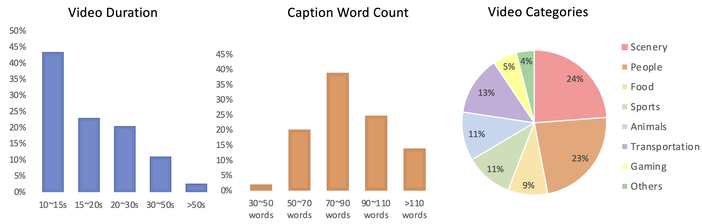

#  LVD-2M: A Long-take Video Dataset with Temporally Dense Captions

Official Github repository of <br>
[LVD-2M: A Long-take Video Dataset with Temporally Dense Captions]()

[Tianwei Xiong](https://github.com/SilentView)<sup>1,\*</sup>,
[Yuqing Wang](https://scholar.google.com/citations?user=QC7nNe0AAAAJ&hl=zh-CN)<sup>1,\*</sup>,
[Daquan Zhou](https://zhoudaquan.github.io/homepage.io/index.html)<sup>2,†</sup>,
[Zhijie Lin](https://scholar.google.com/citations?user=xXMj6_EAAAAJ&hl=zh-CN)<sup>2</sup>,
[Jiashi Feng](https://sites.google.com/site/jshfeng/home)<sup>2</sup>,
[Xihui Liu](https://xh-liu.github.io/)<sup>1,✉</sup>

<sup>1</sup>The University of Hong Kong, <sup>2</sup>ByteDance  
<small>\*Equal contribution. †Project lead. <sup>✉</sup>Corresponding author.</small>

*NeurIPS 2024 Track Datasets and Benchmarks*


[](https://arxiv.org/abs/2410.10816)
[](https://silentview.github.io/LVD-2M/)

## News

**[2024/10/15]** The dataset, the research paper and the [project page](https://silentview.github.io/LVD-2M/) are released!


## Introduction
LVD-2M is a dataset featuring: 
1. long videos covering at least 10 seconds
2. long-take videos without cuts 
3. large motion and diverse contents 
4. temporally dense captions. 

## Dataset Statistics



## Dataset Access

### Quick Walk Through for 100 Randomly Sampled Videos

We randomly sample 100 videos (Youtube source) from LVD-2M, users can download the [videos](https://ic-cv-long-videos.s3.ap-northeast-2.amazonaws.com/LVD-2M/data/random_sample_100.zip) and the [annotation file](https://ic-cv-long-videos.s3.ap-northeast-2.amazonaws.com/LVD-2M/data/random_sample_100.csv). 

We note that even a direct non-cherry picking random sample already presents decent quality.


*We will remove the video samples from our dataset / demonstration if you find them inappropriate. Please contact xiongt20 at gmail dot com for the request.*

### File Downloading

We provide three splits of our video dataset according to their sources: Youtube, [HDVG](https://github.com/daooshee/HD-VG-130M) and [WebVid](https://github.com/m-bain/webvid). 

You can download the three files from the links
- [ytb_600k_720p.csv](https://ic-cv-long-videos.s3.ap-northeast-2.amazonaws.com/LVD-2M/data/ytb_600k_720p.csv)
- [hdvg_300k_720p.csv](https://ic-cv-long-videos.s3.ap-northeast-2.amazonaws.com/LVD-2M/data/hdvg_300k_720p.csv)
- [webvid_1200k_336_short.csv](https://ic-cv-long-videos.s3.ap-northeast-2.amazonaws.com/LVD-2M/data/webvid_1200k_336_short.csv)

The meta records should be put in the following paths:
- `data/ytb_600k_720p.csv`
- `data/hdvg_300k_720p.csv`
- `data/webvid_1200k_336_short.csv`


### Explanations for the Fields of the Meta Files:
Each row in the csv file corresponds to a video clip, the columns are:
- `raw_caption`: The captions generated by LLaVA-v1.6-next-34B. For long video clips, multiple captions seperated by "Caption x:" will be provided.
- `refined_caption`: The refined captions generated by Claude3-Haiku, refining the `raw_caption` into a consistent description of the whole video clip.
- `rewritten_caption`: The rewritten captions generated by LLaMA-v3.1-70B, from the `refined_caption` to a more concise user-input style.
- `key`: The id of the video clip.
- `video_id`: The id of the YouTube video. Note a youtube video can have mutiple video clips.
- `url`: The url of the video. For youtube videos, it is the url of the video that the video clip is from. For webvid videos, it directly points to the video clip.
- `dataset_src`: Where the video clip is from. Values can be [hdvg, panda70m, internvid, webvid].
- `orig_caption`: The original caption of the video clip, given by its `dataset_src`.
- `total score`: The average optical flow score of the video clip.
- `span`: The starting and ending time of the video clip in the original video, for video clips from YouTube only.
- `video_time`: Then length of the video clip.
- `orig_span`: (Trivial content) Special record for HDVG data format. It is a result of HDVG cutting video clips further into smaller clips.
- `scene_cut`: (Trivial content) Special record for HDVG data format.


### Environment
```
conda create --name lvd2m python=3.9
conda activate lvd2m

# install ffmpeg
sudo apt-get install ffmpeg

pip install -r requirements.txt
```

### Video Downloading Script
To download videos from a csv file, run the following command:
```
${PYTHON_PATH} \
download_videos_release.py \
--bsz=96 \
--resolution=720p \
--node_num=1 \
--node_id=0 \
--process_num=96 \
--workdir=cache/download_cache \
--out_dir="dataset/videos" \
--dataset_key="hdvg" \
--multiprocess
```

*Your google accounts may be banned or suspended for too many requets. So you are suggested to use multiple accounts. Set the `ACCOUNT_NUM` in `download_videos_release.py` to specify.*

<details>
<summary>Details for Video Downloading</summary>


We don't provide the video data directly, instead we provide ways to download the videos from their original sources.

Although HDVG dataset is also from youtube, its format is different from other youtube scraped datasets, so it is treated seperately.


### Technical suggestions for downloading videos from YouTube

We use a modified version of [pytube](https://github.com/pytube/pytube) to download the videos. It supports downloading videos from youtube in a parallel, fast and stable way (using multiprocessing and multiple accounts). For more details, check the `download_videos_release.py` script.

Overally, users are suggested to prepare multiple google accounts, run `python download_videos_release.py --reset_auth` for authorization and run the downloading scripts. 

We implemented the mechanism of dividing the request loads to multiple accounts. The processes launched on all the nodes will be evenly assigned to different accounts.

*Note: the code for downloading videos from youtube could fail due to variation in youtube api behaviors, you can check the issues in [pytube](https://github.com/pytube/pytube) for updates.*

### Disclaimer about WebVid

We **don't provide** code for downloading videos from **webvid** (whose videos are from stock footage providers) for two reasons:
1. Users can directly access these video clips through the provided urls, which is much simper than video clips from youtube.
2. To avoid possible violation of copyrights.
</details>


## License
The video data is collected from publicly available resources. The license of this dataset is the same as [License of HD-VILA](https://raw.githubusercontent.com/microsoft/XPretrain/main/hd-vila-100m/LICENSE).


## Acknowledgements

Here we list the projects that inspired and helped us to build LVD-2M.

- [Panda-70M](https://github.com/snap-research/Panda-70M), [HD-VG-130M](https://github.com/daooshee/HD-VG-130M), [InternVid](https://github.com/OpenGVLab/InternVideo/tree/main/Data/InternVid) and [WebVid](https://github.com/m-bain/webvid) are the sources of our video data.
-  [RAFT](https://github.com/princeton-vl/RAFT), [PLLaVA](https://github.com/magic-research/PLLaVA), [LLaVA-Next-v1.6](https://github.com/haotian-liu/LLaVA) are important parts for our data pipeline.
- [PySceneDetect](https://github.com/Breakthrough/PySceneDetect) and [pytube](https://github.com/pytube/pytube) provide effective tools for video data collection.

## Citation
```bibtex
@article{xiong2024lvd2m,
      title={LVD-2M: A Long-take Video Dataset with Temporally Dense Captions}, 
      author={Tianwei Xiong and Yuqing Wang and Daquan Zhou and Zhijie Lin and Jiashi Feng and Xihui Liu},
      year={2024},
      journal={arXiv preprint arXiv:2410.10816}
}
```


